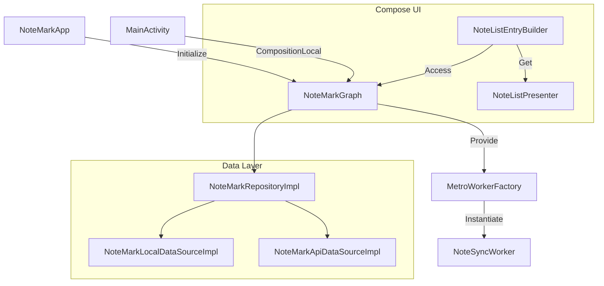

# Requirements Pelan

### Overview & Goals
Migrate the dependency injection framework from Koin to Metro 1.4.0 to leverage compile-time safety and KSP-based code generation.

### Scope
- **In Scope**:
    - Adding Metro dependencies and KSP configuration.
    - Defining a central `NoteMarkGraph`.
    - Migrating all service, repository, and UI-related dependencies.
    - Implementing assisted injection for components with runtime parameters.
    - Integrating Metro with WorkManager and Compose.
    - Complete removal of Koin.
- **Out of Scope**:
    - Functional changes to the app's business logic.
    - Refactoring state management (FlowRedux/Molecule).

### Functional Requirements
- The app must continue to function as before, with all features (login, note list, edit note, sync) operational.
- Presenters must be correctly scoped and retained during recomposition where applicable (using `retain`).
- `NoteSyncWorker` must correctly inject its dependencies via Metro.

# Technical Design

### Current Implementation
- Uses Koin for DI, defined in `AppModule.kt`.
- Uses `single`, `factory`, and `worker` definitions.
- Uses named qualifiers for `DataStore` and `CoroutineDispatcher`.
- Uses `parametersOf` for runtime parameters (e.g., `noteId` for `EditNotePresenter`).
- Injected in Compose using `KoinJavaComponent.get()` within `EntryBuilders`.

### Key Decisions
- **Single App-wide Graph**: A single `NoteMarkGraph` will manage all dependencies for simplicity.
- **Assisted Injection**: Metro's `@AssistedInject` and `@AssistedFactory` will be used for `EditNotePresenter` and `EditNoteStateMachineFactory`.
- **CompositionLocal**: The graph will be provided to the Compose tree via `LocalNoteMarkGraph` to allow easy access in `EntryBuilders`.
- **Custom WorkerFactory**: A `MetroWorkerFactory` will be implemented to support injecting dependencies into `NoteSyncWorker`.

### Proposed Changes
- **Dependency Definitions**:
    - Annotate implementation classes with `@Inject constructor`.
    - Use `@Provides` in a `@DependencyGraph` or `@Module` for third-party instances (Ktor `HttpClient`, SQLDelight `SqlDriver`).
- **Qualifiers**:
    - Define custom annotations like `@AppBackgroundDispatcher` to replace Koin's `named()`.
- **Compose Integration**:
    - Wrap the root Composable in `MainActivity` with `CompositionLocalProvider`.
    - Update `EntryBuilders` to use `LocalNoteMarkGraph.current.launcherPresenter()` etc.

### Architecture Diagram

### File Structure Changes
- **Added**:
    - `app/src/main/java/com/dhimandasgupta/notemark/app/di/NoteMarkGraph.kt`
    - `app/src/main/java/com/dhimandasgupta/notemark/app/di/Qualifiers.kt`
    - `app/src/main/java/com/dhimandasgupta/notemark/app/di/MetroWorkerFactory.kt`
- **Modified**:
    - `app/src/main/java/com/dhimandasgupta/notemark/app/NoteMarkApp.kt`
    - `app/src/main/java/com/dhimandasgupta/notemark/ui/activity/MainActivity.kt`
    - All `Entry.kt` files in `features/`.
    - All Presenters and Repositories to add `@Inject`.
- **Removed**:
    - `app/src/main/java/com/dhimandasgupta/notemark/app/di/AppModule.kt`

# Testing

### Validation Approach
- Verify successful compilation with Metro's KSP processor.
- Manually test the app's main flows to ensure DI is working correctly.

### Key Scenarios
- **App Launch**: Verify `LauncherPresenter` is correctly injected and connection state is shown.
- **Login/Registration**: Verify `LoginPresenter` and `RegistrationPresenter` work and interact with the API.
- **Note List**: Verify `NoteListPresenter` fetches and displays notes.
- **Edit Note**: Verify `EditNotePresenter` receives the `noteId` via assisted injection and saves changes.
- **Syncing**: Verify `NoteSyncWorker` runs and successfully syncs notes (using WorkManager logs).

### Edge Cases
- **Retained Presenters**: Ensure Presenters are not re-created on every recomposition by correctly using `retain` with the Metro Graph.
- **Named Dependencies**: Ensure the correct `DataStore` (User vs Sync) and `Dispatcher` are injected where qualified.

# Delivery Steps

###   Step 1: Add Metro dependencies and configuration
Add Metro library to the project's version catalog and build configuration.

- Update `gradle/libs.versions.toml` to include `metro` version 1.4.0 and the corresponding KSP plugin.
- Add `metro-runtime` and `metro-compiler` (KSP) to `app/build.gradle.kts`.
- Ensure the KSP plugin is correctly applied in the `plugins` block.

###   Step 2: Implement Metro Graph and migrate core dependencies
Define the Metro Graph, custom qualifiers, and migrate core dependencies.

- Create `NoteMarkGraph.kt` annotated with `@DependencyGraph`.
- Define custom `@Qualifier` annotations for named dependencies: `@AppBackgroundDispatcher`, `@AppBackgroundScope`, `@UserDataStore`, and `@SyncDataStore`.
- Implement Metro modules for `HttpClient`, `Database`, and `DataStore` providers, migrating logic from `AppModule.kt`.
- Add `@Inject` to constructors of Repositories and DataSources.
- Define `@Binds` or `@Provides` in the Graph/Modules for all interfaces.

###   Step 3: Migrate Presenters and StateMachine Factories
Update Presenters and StateMachine Factories to use Metro's `@Inject` and `@AssistedInject`.

- Add `@Inject` constructor to all Presenters (`LauncherPresenter`, `LoginPresenter`, etc.).
- Update `EditNotePresenter` and `EditNoteStateMachineFactory` to use `@AssistedInject` with `noteId`.
- Define `@AssistedFactory` interfaces for assisted components.
- Migrate StateMachineFactories to use `@Inject` where possible.

###   Step 4: Initialize Metro and integrate with WorkManager
Set up Metro in the Application class and integrate with WorkManager.

- Update `NoteMarkApp.kt` to initialize the `NoteMarkGraph`.
- Implement `MetroWorkerFactory` to handle `NoteSyncWorker` injection via `@AssistedInject`.
- Update `NoteMarkApp.kt` to set the custom `WorkerFactory` in `WorkManager` configuration.
- Update `NoteSyncWorker.kt` to use constructor injection instead of Koin's `by inject`.

###   Step 5: Integrate Metro with Compose UI
Provide the Graph to the Compose tree and update all entry points.

- Create `LocalNoteMarkGraph` using `staticCompositionLocalOf`.
- Update `MainActivity.kt` to wrap `NoteMarkRoot` with `CompositionLocalProvider(LocalNoteMarkGraph provides graph)`.
- Update all `EntryBuilder` functions (e.g., `LauncherEntryBuilder`, `NoteEditEntryBuilder`) to retrieve Presenters from the graph using `LocalNoteMarkGraph.current`.
- Remove all Koin `get()` and `parametersOf()` calls from the UI layer.

###   Step 6: Finalize Koin removal and cleanup
Remove all Koin-related code and dependencies from the project.

- Delete `app/src/main/java/com/dhimandasgupta/notemark/app/di/AppModule.kt`.
- Remove Koin initialization from `NoteMarkApp.kt`.
- Remove Koin imports from all modified files.
- Remove Koin dependencies from `gradle/libs.versions.toml` and `app/build.gradle.kts`.